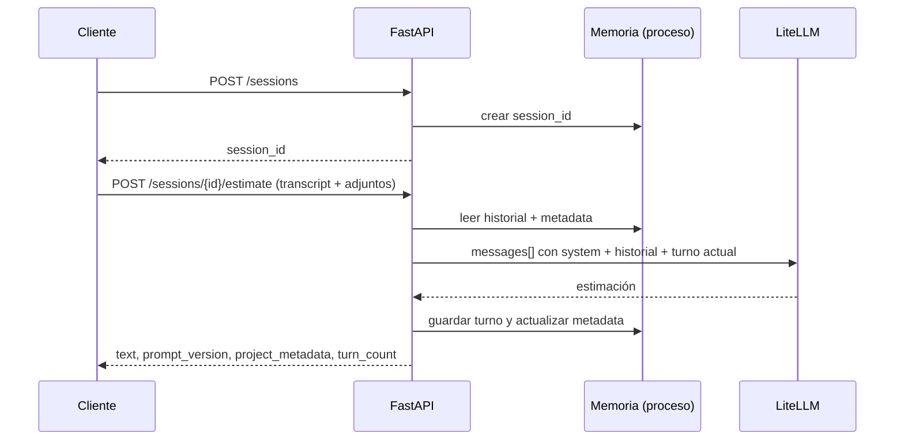

# Estimador CAG


Servicio de estimación de proyectos de software con **FastAPI**, **LiteLLM** y plantillas **Jinja2** versionadas.

| Modo | Para qué sirve | Endpoint principal |
|------|----------------|-------------------|
| **Formulario (Sesión 4)** | Una petición, una estimación completa con enums tipados | `POST /api/v1/estimate` |
| **Conversación (Sesión 5)** | Varios turnos en la misma sesión, con memoria y adjuntos | `POST /api/v1/sessions/{id}/estimate` |
| **Embeddings (Sesión 7)** | Presupuestos JSON → chunks → vectores (en memoria, sin pgvector) | `POST /api/v1/embeddings/ingest` (alias: `POST /embeddings/ingest`) |

El cliente **Streamlit** cubre formulario y conversación en pestañas; el pipeline de embeddings se consume por HTTP (curl, Swagger u otro backend).

Parte del programa **Master en AI Engineering**. Referencia LIDR: [session_4/estimator](https://github.com/LIDR-academy/ai-engineering/tree/session_4/estimator). Planes locales: [`session-04`](docs/plans/session-04/README.md) · [`session-05`](docs/plans/session-05/README.md) · [`session-06`](docs/plans/session-06/README.md) · [`session-07`](docs/plans/session-07/README.md).

## Requisitos

- Python 3.11+ ([`.python-version`](.python-version))
- [uv](https://docs.astral.sh/uv/)
- API key de OpenAI y/o Anthropic en `.env`
- Redis (opcional; cache solo en el modo formulario)

## Configuración rápida

```bash
cp .env.example .env
# Rellena OPENAI_API_KEY y/o ANTHROPIC_API_KEY
uv sync --extra dev
docker compose up -d redis   # opcional
```

Variables relevantes para la **Sesión 5** (además de las del LLM):

| Variable | Default | Uso |
|----------|---------|-----|
| `SESSION_MAX_TURNS` | `6` | Pares user/assistant que se conservan en memoria (ventana deslizante) |
| `MAX_ATTACHMENT_BYTES` | `5000000` | Tamaño máximo por archivo adjunto |
| `MAX_ATTACHMENTS_PER_REQUEST` | `5` | Archivos por turno |
| `ESTIMATOR_API_BASE_URL` | `http://localhost:8000` | URL que usa Streamlit |

## Cómo levantar

### API (FastAPI)

```bash
uv run uvicorn app.main:app --reload --host 0.0.0.0 --port 8000
```

- Documentación interactiva: `http://localhost:8000/docs`
- Health: `GET http://localhost:8000/health`

### Cliente Streamlit

Proceso aparte; habla con la API por HTTP:

```bash
uv run streamlit run streamlit_app.py
# http://localhost:8501
```

- Pestaña **Conversación (Sesión 5)**: crea sesión automáticamente, chat multi-turno, adjuntos PDF/DOCX, metadata en la barra lateral.
- Pestaña **Formulario clásico (Sesión 4)**: mismo flujo que antes (`POST /api/v1/estimate`).

---

## Modo 1 — Formulario (Sesión 4)

Un JSON con `description` y tres enums. Respuesta: texto libre + `prompt_version`.

```bash
curl -X POST http://localhost:8000/api/v1/estimate \
  -H "Content-Type: application/json" \
  -d '{
    "description": "A small B2B SaaS to manage employee equipment loans across teams.",
    "project_type": "web_saas",
    "detail_level": "medium",
    "output_format": "phases_table"
  }'
```

```json
{
  "text": "| phase | duration_weeks | cost_eur | …",
  "prompt_version": "v1"
}
```

**Variantes útiles**

- Plantilla **v2**: `?prompt_version=v2` (mismo body).
- **Streaming** (SSE): `POST /api/v1/estimate/stream` con eventos `status`, `token`, `complete`, `error`.
- **Proyectos de referencia** (opcional): campo `reference_projects` en el JSON (bloque `<reference_projects>` en el system prompt).
- **Cache Redis**: mismas entradas system+user+modelo → misma respuesta durante `CACHE_TTL_SECONDS`.

---

## Modo 2 — Conversación con sesión (Sesión 5)

### Flujo en tres pasos

```text
1. POST /api/v1/sessions              →  { "session_id": "<uuid>" }
2. POST /api/v1/sessions/{id}/estimate (multipart, un turno)
3. GET  /api/v1/sessions/{id}          (debug de memoria/tier)
4. (Opcional) POST /api/v1/sessions/{id}/estimate-acb
```

La sesión guarda en memoria:

- **Historial** (`ConversationHistory`): últimos `SESSION_MAX_TURNS` pares user/assistant (ventana deslizante).
- **Metadata** (`ProjectMetadata`): hechos estables del proyecto (nombre, tecnologías, alcance…), separados del historial e inyectados en el system prompt.



### Crear sesión

```bash
curl -s -X POST http://localhost:8000/api/v1/sessions
# {"session_id":"550e8400-e29b-41d4-a716-446655440000"}
```

### Enviar un turno (multipart)

Campos del formulario:

| Campo | Tipo | Obligatorio | Descripción |
|-------|------|-------------|-------------|
| `transcript` | form field | Sí | Mensaje del usuario en este turno |
| `attachments` | file(s) | No | PDF o DOCX (hasta `MAX_ATTACHMENTS_PER_REQUEST`) |
| `prompt_version` | query | No | `v1` (default) o `v2` |
| `tier` | query | No | Override opcional: `default`, `executive`, `pm`, `developer` |

**Solo texto:**

```bash
SESSION_ID="<uuid-de-paso-anterior>"

curl -s -X POST "http://localhost:8000/api/v1/sessions/${SESSION_ID}/estimate" \
  -F 'transcript=Project called InventoryHub with React. Team of 4 developers.'
```

**Con adjunto:**

```bash
curl -s -X POST "http://localhost:8000/api/v1/sessions/${SESSION_ID}/estimate" \
  -F 'transcript=Please review the attached scope document.' \
  -F 'attachments=@./docs/scope-ejemplo.docx'
```

Respuesta de un turno:

```json
{
  "text": "…estimación del LLM…",
  "prompt_version": "v1",
  "turn_count": 2,
  "tier": "pm",
  "tier_rule": "small_team_pm",
  "project_metadata": {
    "project_name": "InventoryHub",
    "assumed_team_size": 4,
    "mentioned_technologies": ["React"],
    "agreed_scope": "…",
    "explicit_constraints": [],
    "rejected_options": []
  }
}
```

Debug de sesión:

```bash
curl -s "http://localhost:8000/api/v1/sessions/${SESSION_ID}"
```

Respuesta (campos principales):

```json
{
  "message_count": 6,
  "anchors_count": 3,
  "summary_chars": 840,
  "last_resolved_tier": "pm",
  "last_tier_rule": "small_team_pm"
}
```

Modo ACB opcional:

```bash
curl -s -X POST "http://localhost:8000/api/v1/sessions/${SESSION_ID}/estimate-acb" \
  -F 'transcript=Refine estimate with stronger risk mitigation'
```

El endpoint **stateless** `POST /api/v1/estimate` sigue disponible y no comparte memoria con las sesiones.

---

## Modo 3 — Pipeline de embeddings (Sesión 7)

Presupuestos históricos en JSON → chunking estructural (1 componente = 1 chunk) → embeddings OpenAI `text-embedding-3-small`. Los vectores se devuelven en la respuesta HTTP; no hay persistencia en base vectorial (eso es Sesión 8).

Datos de ejemplo: [`data/budgets_sample.json`](data/budgets_sample.json) (15 presupuestos). Sanity check de similitud: [`app/embedding_pipeline/SANITY_CHECK.md`](app/embedding_pipeline/SANITY_CHECK.md).

### Ingest (API)

```bash
# Con la API en marcha (uvicorn :8000)
jq -n --slurpfile b data/budgets_sample.json '{budgets: $b[0]}' \
  | curl -s -X POST http://localhost:8000/api/v1/embeddings/ingest \
      -H "Content-Type: application/json" \
      -d @- \
  | jq '{stats, chunk_count: (.chunks | length), first_chunk_id: .chunks[0].chunk_id}'
```

También puedes probar el body desde Swagger: `http://localhost:8000/docs` → **embeddings** → `POST /api/v1/embeddings/ingest` (misma operación en `POST /embeddings/ingest`, alias del material).

Tras `docker compose build api`, el contenedor incluye `scripts/compare.py` y `data/budgets_sample.json` en `/app`.

Respuesta: `chunks[]` (cada uno con `embedding` de 1536 dimensiones) y `stats` (`total_budgets`, `total_chunks`, `total_tokens`, `estimated_cost_usd`).

### Comparar dos textos (CLI)

Fuera del contenedor (carga `.env` automáticamente):

```bash
uv run python scripts/compare.py \
  --text-a "OAuth 2.0 authentication backend for fintech" \
  --text-b "JWT-based authorization service for banking app"
```

Dentro de Docker Compose (servicio `api`):

```bash
docker compose exec api python scripts/compare.py \
  --text-a "OAuth 2.0 authentication backend for fintech" \
  --text-b "JWT-based authorization service for banking app"
```

Requiere `OPENAI_API_KEY`. Plan e informe de cumplimiento: [`docs/plans/session-07/`](docs/plans/session-07/README.md).

### Benchmark OpenAI vs modelo local (opcional, sesión en vivo)

Compara latencia y dimensiones entre `text-embedding-3-small` (1536 y 256 dims) y MiniLM local. **No** forma parte del entregable S7; requiere dependencias extra (PyTorch vía `sentence-transformers`).

```bash
uv sync --extra dev --extra benchmark
uv run python app/embedding_pipeline/embedding_benchmark.py
```

Salida ejemplo: dicts con `model`, `total_seconds`, `per_text_ms`, `dimensions`. Solo local con `uv run`; no está en la imagen Docker `api`.

---

## Adjuntos: Camino B (extracción local)

No usamos visión del modelo ni RAG en esta fase. Los archivos se procesan **en el servidor** antes de llamar al LLM:

| Formato | Librería | Qué hace |
|---------|----------|----------|
| PDF | `pypdf` | Extrae texto de cada página |
| DOCX | `python-docx` | Extrae párrafos |

**Por qué Camino B**

- Menor coste y latencia que enviar binarios al LLM.
- Comportamiento predecible en tests (texto fijo en el prompt).
- Adecuado para documentos con texto seleccionable; no sustituye OCR de escaneos.

El texto extraído se añade al turno del usuario con delimitadores:

```text
--- attachment: scope.pdf ---
<texto extraído>
```

Ese bloque viaja en el mensaje `user` del historial. Tipos no permitidos (p. ej. `.exe`) devuelven **400** con `error: unsupported_file_type`.

---

## Cómo se actualiza `project_metadata`

Tras cada turno completado, una **heurística simple** (sin LLM extra) enriquece la metadata a partir del transcript y de la respuesta del asistente:

| Señal en el texto | Campo actualizado |
|-------------------|-------------------|
| `project called X`, `app named X` | `project_name` |
| `team of N`, `N developers` | `assumed_team_size` |
| Palabras clave (React, PostgreSQL, FastAPI, …) | `mentioned_technologies` |
| Último transcript (recortado) | `agreed_scope` |
| Frases con *must* / *cannot* | `explicit_constraints` |
| *don't want*, *reject*, *instead of* | `rejected_options` |

La metadata se inyecta en el **system prompt** dentro de `<project_metadata>` (solo si hay contenido). El historial de chat no se mezcla con estos hechos: así el modelo trata la metadata como contexto estable y el historial como diálogo reciente.

---

## Limitaciones actuales (Sesión 5)

| Tema | Comportamiento |
|------|----------------|
| **Persistencia** | Las sesiones viven en un `dict` en memoria del proceso. Al reiniciar uvicorn se pierden. |
| **Varios workers** | Cada worker tiene su propio almacén; no compartir `session_id` entre procesos. |
| **TTL / archivado** | No hay expiración automática de sesiones inactivas. |
| **Cache Redis** | Solo aplica al modo formulario (`/estimate`), no a turnos de sesión. |
| **Adjuntos** | PDF/DOCX con texto extraíble; escaneos imagen necesitarían OCR (fuera de alcance). |
| **Metadata** | Heurística básica; puede omitir o sobrescribir datos si el lenguaje es ambiguo. |
| **ACB** | Implementación inicial opcional; la iteración avanzada Actor-Critic-Boss sigue siendo simplificada. |

Para producción haría falta Redis/PostgreSQL para sesiones, política de TTL y, si aplica, extracción más robusta de documentos.

---

## Probar streaming (modo formulario)

```bash
curl -N -X POST http://localhost:8000/api/v1/estimate/stream \
  -H "Content-Type: application/json" \
  -d '{
    "description": "Internal tool for marketing assets with search and approvals.",
    "project_type": "internal_tool",
    "detail_level": "medium",
    "output_format": "phases_table"
  }'
```

## Tests

```bash
uv run pytest
```

La suite no llama a APIs externas (LLM y Redis mockeados donde hace falta):

| Archivo | Qué cubre |
|---------|-----------|
| `tests/test_schemas.py` | Validación `EstimationRequest` |
| `tests/test_prompts.py` | Jinja2, `v1`/`v2`, referencias, `<project_metadata>` |
| `tests/test_sessions.py` | Ventana deslizante, `SessionStore` |
| `tests/test_sessions_endpoint.py` | HTTP sesiones y multipart |
| `tests/test_session_estimation.py` | Orquestación de turno y heurísticas |
| `tests/test_session_integration.py` | Memoria multi-turno, adjuntos en prompt, ventana |
| `tests/test_attachments.py` | Extracción PDF/DOCX |
| `tests/test_estimate_*.py` | Estimate stateless y cache |
| `tests/test_llm_wrapper.py` | LiteLLM, mensajes multi-turno |
| `tests/test_health.py` | Health check |
| `tests/test_embedding_schemas.py` | Schemas de presupuestos/chunks |
| `tests/test_chunker.py` | Chunker estructural JSON |
| `tests/test_embedder.py` | Batching y reintentos del embedder (mock) |
| `tests/test_embeddings_router.py` | `POST /api/v1/embeddings/ingest` |
| `tests/test_similarity.py` | Similitud coseno (stdlib) |
| `tests/test_embedding_benchmark.py` | Harness de benchmark (mock, sin red) |

Los tests de embeddings **no** llaman a OpenAI; el sanity check manual sí (ver `SANITY_CHECK.md`).

### Evals (Session 06 parity)

Dataset golden y runner CLI:

```bash
uv run python evals/run.py --mode actor
uv run python evals/run.py --mode acb
```

Incluye 16 casos en `evals/golden_dataset.json` y 3 métricas binarias:
- `SchemaAdherenceMetric`
- `CostBoundsMetric`
- `ContentRecallMetric`

Stress runner (escenarios multi-turno + adjuntos + CSV):

```bash
# API en marcha (uvicorn en :8000) y claves LLM en .env
uv run python -m evals.stress.run \
  --http http://127.0.0.1:8000 \
  --scenarios growing,pivot,contradiction \
  --attachment-sizes 0,5,20,50,100 \
  --repeats 3 \
  --mode actor \
  --latency-budget-ms 8000 \
  --cost-budget-usd 0.25 \
  --max-error-rate 0.2 \
  --output evals/stress/results.csv

# Smoke in-process (sin LLM real, útil en CI):
# uv run python -m evals.stress.run --scenarios growing --attachment-sizes 0 --repeats 1

# Reporte cuantitativo desde el CSV (Fase 5)
uv run python -m evals.stress.build_report
```

Artefactos generados:
- `evals/stress/results.csv`
- `evals/stress/REPORT.md` (regenerable con `build_report`)

Coste orientativo de la corrida completa: ~900 llamadas LLM (3 escenarios × 5 tamaños × 3 repeticiones × 20 turnos). Para validar el pipeline antes, usa un solo escenario y `--repeats 1`.

Si el repo está en Google Drive y ves `TimeoutError` al escribir el CSV, el runner guarda primero en `/tmp` y copia al final; también puedes usar `--output /tmp/results.csv`.

```bash
uv run python scripts/validate_structure.py
```

## Estructura del proyecto

```
estimador-cag/
├── app/
│   ├── main.py
│   ├── config.py
│   ├── routers/
│   │   ├── estimations.py      # POST /api/v1/estimate (+ /stream)
│   │   └── sessions.py         # POST /api/v1/sessions, .../estimate
│   ├── embedding_pipeline/     # Sesión 7: chunker, embedder, ingest
│   │   ├── chunker.py
│   │   ├── embedder.py
│   │   ├── router.py
│   │   ├── schemas.py
│   │   ├── similarity.py
│   │   ├── embedding_benchmark.py  # Lab: OpenAI vs MiniLM (extra benchmark)
│   │   └── SANITY_CHECK.md
│   ├── schemas/
│   │   ├── estimation.py
│   │   └── sessions.py
│   ├── prompts/
│   │   ├── loader.py
│   │   └── estimation/
│   │       ├── project_metadata.j2
│   │       ├── v1/  (system, user, examples)
│   │       └── v2/
│   └── services/
│       ├── sessions.py           # SessionStore, historial, metadata
│       ├── session_estimation.py # Turno + heurísticas
│       ├── attachments.py        # Camino B PDF/DOCX
│       ├── llm_wrapper.py
│       ├── llm_service.py
│       └── cache.py
├── tests/
├── streamlit_app.py
├── data/
│   └── budgets_sample.json     # 15 presupuestos (Sesión 7)
├── scripts/
│   ├── compare.py              # Similitud coseno entre dos textos
│   └── validate_structure.py
├── docs/plans/session-04/
├── docs/plans/session-05/
├── docs/plans/session-06/
├── docs/plans/session-07/
├── evals/                      # Golden dataset + stress (Sesión 6)
└── pyproject.toml
```

### Versionado de prompts

Plantillas en `app/prompts/estimation/<version>/`. Para una nueva versión: copiar `v1/` → `vN/`, editar `.j2` y pasar `prompt_version=vN` en query (formulario o sesión).

## Variables de entorno

| Variable | Default | Notas |
|----------|---------|--------|
| `OPENAI_API_KEY` | — | Al menos una key LLM |
| `ANTHROPIC_API_KEY` | — | Al menos una key LLM |
| `LLM_PROVIDER` | `openai` | Proveedor principal |
| `LLM_MODEL` | `gpt-4o-mini` | Modelo principal |
| `REDIS_URL` | `redis://localhost:6379/0` | Cache modo formulario |
| `CACHE_TTL_SECONDS` | `86400` | TTL cache (24 h) |
| `SESSION_MAX_TURNS` | `6` | Ventana de historial en sesiones |
| `MAX_CONVERSATION_TURNS` | `6` | Alias compatible Session 06 para ventana |
| `MAX_SUMMARY_CHARS` | `4000` | Tamaño máximo del summary acumulativo |
| `MAX_ANCHORS` | `20` | Máximo anchors heurísticos persistidos |
| `METADATA_EXTRACTOR_MODEL` | `gpt-4o-mini` | Modelo barato de extractor metadata |
| `ENABLE_ACB` | `true` | Habilita endpoint `/estimate-acb` |
| `ACB_MAX_ITERATIONS` | `2` | Iteraciones máximas de lazo ACB |
| `MAX_ATTACHMENT_BYTES` | `5000000` | Límite por adjunto |
| `MAX_ATTACHMENTS_PER_REQUEST` | `5` | Adjuntos por turno |
| `ESTIMATOR_API_BASE_URL` | `http://localhost:8000` | Cliente Streamlit |
| `APP_ENV` | `development` | En dev, 502 incluye detalle JSON |

### Si aparece 502 (`Upstream LLM call failed`)

1. Claves en `.env` en la carpeta desde la que arrancas **uvicorn**; reinicia tras editar.
2. `LLM_PROVIDER` / `LLM_MODEL` alineados con la key disponible.
3. `ESTIMATOR_API_BASE_URL` apunta al puerto real del API (Streamlit).
4. Con `APP_ENV=development`, el JSON del 502 incluye `error_type`, `error` y `hint`; en terminal verás `estimation_llm_failed` o `session_estimation_llm_failed`.

## Docker

```bash
docker compose build
docker compose up
```

API + Redis. Streamlit fuera de Compose contra `ESTIMATOR_API_BASE_URL`.

## CI

En push/PR a `main`/`master`: validación de estructura y `pytest`.

## Documentación adicional

- Plan Sesión 04: [`docs/plans/session-04/`](docs/plans/session-04/README.md)
- Plan Sesión 05: [`docs/plans/session-05/`](docs/plans/session-05/README.md)
- Plan Sesión 06 (stress CAG): [`docs/plans/session-06/`](docs/plans/session-06/README.md) — incluye [`GAP-ANALISIS.md`](docs/plans/session-06/GAP-ANALISIS.md)
- Plan Sesión 07 (embeddings): [`docs/plans/session-07/`](docs/plans/session-07/README.md) — incluye [`GAP-ANALISIS.md`](docs/plans/session-07/GAP-ANALISIS.md)
- Índice de documentación: [`docs/README.md`](docs/README.md)
- Texto de ejemplo para `description`: [`docs/transcripcion-reunion.md`](docs/transcripcion-reunion.md)

## Ramas de desarrollo

| Rama | Contenido principal |
|------|---------------------|
| `pre-session-06` | Stress evals, `turn_observed`, reportes |
| `pre-session-07` | Pipeline `embedding_pipeline` + ingest + `compare.py` (incluye base S6) |
