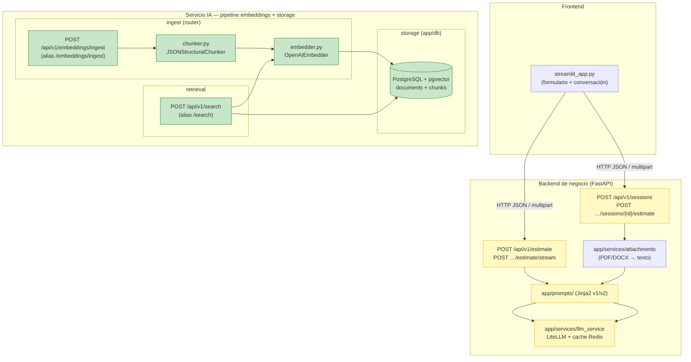
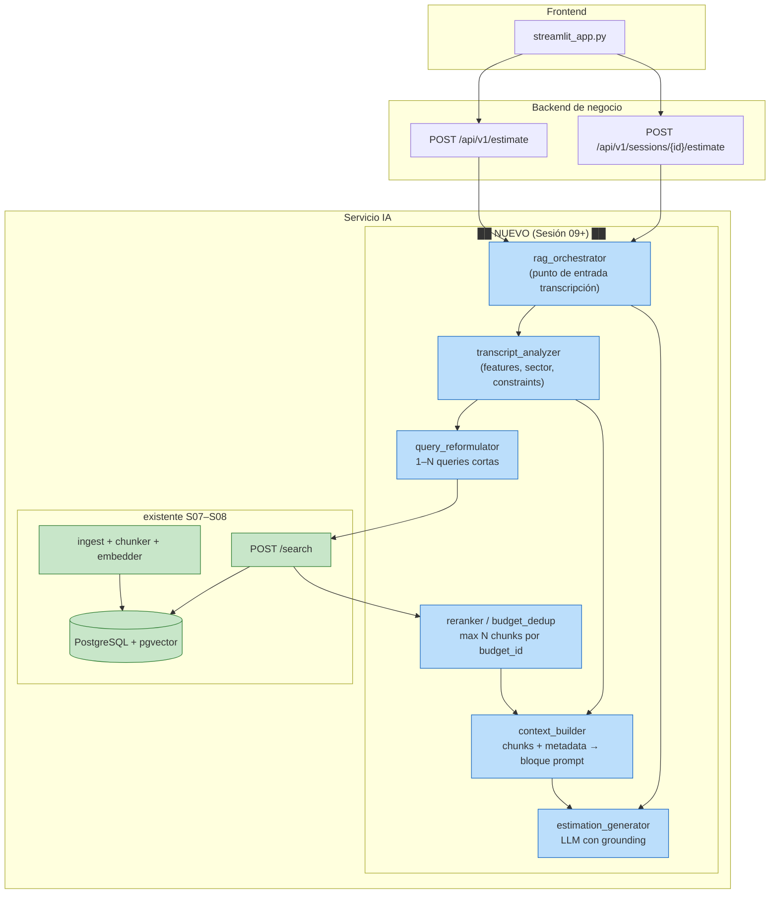

# Diagnóstico arquitectónico — Sesión 09 (pre-work)

Repositorio: `estimador-cag` · Rama base: `pre-session-08` · Trace sobre `examples/transcripts/02_ambiguous.txt`

---

## 1. Diagrama de la arquitectura actual

Tres capas con el detalle del servicio IA al cierre de Sesión 08. Las cajas sombreadas (`██`) marcan **dónde termina** lo implementado hoy: el flujo se detiene en la búsqueda semántica; no hay puente hacia una estimación generada a partir de la transcripción.



**Lectura del diagrama**

- **Verde:** piezas operativas de S07–S08 (chunk → embed → persistir → buscar top-k).
- **Amarillo:** estimación conversacional/formulario que llama al LLM **sin** pasar por retrieval.
- **Sin caja:** no existe hoy un módulo que reciba una transcripción cruda, recupere presupuestos similares y genere una estimación fundamentada en ellos.

Si llega `02_ambiguous.txt` por el camino de negocio (`/estimate` o sesión), el texto va directo al prompt del LLM. Si se embebe y se llama a `/search`, se obtienen chunks históricos, pero **nadie consume ese resultado** para producir la estimación.

---

## 2. Trace anotado de `02_ambiguous.txt`

Transcripción: Rubén (Casa Castaño, tienda gourmet) quiere vender online, programa de fidelización, panel de ventas/stock, pagos con tarjeta y emails de confirmación — con mucho ruido conversacional y sin stack tecnológico explícito.

**Prerrequisitos ejecutados**

```bash
docker compose up -d postgres ai_service
docker compose exec ai_service uv run alembic upgrade head
docker compose exec ai_service uv run python scripts/ingest_sample_corpus.py
# Summary: created=0 skipped=15 errors=0  (corpus ya cargado)
```

### Paso 1 — Embeber la transcripción completa

No hay endpoint HTTP que devuelva el vector crudo; el embedding ocurre dentro de `/search`. El material permite usar el **módulo** con el mismo modelo que el servicio (`text-embedding-3-small`). Script de cliente:

```bash
uv run examples/trace_s09.py examples/transcripts/02_ambiguous.txt
```

**Salida (STEP 1):**

```
transcript      : examples/transcripts/02_ambiguous.txt
model           : text-embedding-3-small
dimensionality  : 1536
L2 norm         : 1.000350
first component : 0.006248
last component  : 0.019028
```

**Comentario:** El vector tiene 1536 dimensiones (modelo `text-embedding-3-small`) y norma L2 ≈ 1.0, coherente con embeddings normalizados de OpenAI. Representa un **promedio semántico diluido** de toda la reunión: tienda física, ecommerce, fidelización, panel, pagos, emails y divagaciones comparten el mismo embedding. Eso explica por qué la señal útil (checkout, catálogo) compite con ruido (anécdotas familiares, incertidumbre de alcance).

Equivalente mínimo sin el script (solo paso 1):

```bash
uv run python -c "
from dotenv import load_dotenv; load_dotenv()
import math
from pathlib import Path
from app.embedding_pipeline.embedder import OpenAIEmbedder
text = Path('examples/transcripts/02_ambiguous.txt').read_text(encoding='utf-8')
v = OpenAIEmbedder().embed_one(text)
print('dim', len(v), 'norm', math.sqrt(sum(x*x for x in v)), 'first', v[0], 'last', v[-1])
"
```

### Paso 2 — Búsqueda semántica (top-5)

`/search` acepta texto (no vector) y re-embebe internamente con el mismo modelo:

```bash
curl -s -X POST http://localhost:8000/api/v1/search \
  -H "Content-Type: application/json" \
  --data-binary @<(jq -n --rawfile q examples/transcripts/02_ambiguous.txt '{query: $q, k: 5}') \
  | jq
```

**Respuesta cruda (resumen de `results`; `search_time_ms`: 745):**

| rank | chunk_id | distance | budget_id   | sector    | component (abrev.)        |
|------|----------|----------|-------------|-----------|---------------------------|
| 1    | 4        | 0.6326   | BUD-2023-008 | ecommerce | Product catalog service   |
| 2    | 5        | 0.6349   | BUD-2023-008 | ecommerce | Checkout and payments     |
| 3    | 6        | 0.6447   | BUD-2023-008 | ecommerce | Merchant admin dashboard  |
| 4    | 22       | 0.6473   | BUD-2023-012 | ecommerce | Multi-vendor catalog      |
| 5    | 36       | 0.6607   | BUD-2023-025 | ecommerce | Storefront widgets        |

**JSON completo del hit #1:**

```json
{
  "chunk_id": 4,
  "document_id": 2,
  "chunk_type": "budget_component",
  "content": "[Project: Headless e-commerce platform with catalog sync and checkout]\n[Client sector: ecommerce | Year: 2023 | Main tech: node_express]\n\nComponent: Product catalog service\nDescription: CRUD for products, variants, and inventory with Elasticsearch-backed search.\nTech stack: node_express, mongodb, elasticsearch\nComplexity: medium\nEstimated hours: 140",
  "distance": 0.6326,
  "metadata": {
    "year": 2023,
    "budget_id": "BUD-2023-008",
    "complexity": "medium",
    "component_id": "CAT-101",
    "client_sector": "ecommerce",
    "estimated_hours": 140,
    "main_technology": "node_express"
  }
}
```

**Comentario:** Las distancias coseno se comprimen en un rango estrecho (0.63–0.66): todos los hits parecen “igual de relevantes”. El top-3 son **tres componentes del mismo presupuesto** (`BUD-2023-008`, headless ecommerce ShopNova). El retrieval captura parcialmente “vender online” y “pagos”, pero no discrimina bien entre necesidades distintas dentro de la misma transcripción.

### Paso 3 — Lectura de los chunks devueltos

**Chunk 1 — `BUD-2023-008` / CAT-101 (catalog, distance 0.6326)**  
Presupuesto histórico: plataforma ecommerce headless (ShopNova, sector ecommerce, Node/Express). **Relevante** para “vender por internet” y catálogo de productos gourmet, aunque el chunk asume Elasticsearch y un catálogo más complejo que una tienda pequeña.

**Chunk 2 — `BUD-2023-008` / CHK-102 (checkout & Stripe, distance 0.6349)**  
Mismo presupuesto. **Relevante** para “pagar con tarjeta” y carrito; encaja con la preocupación de Rubén por el abandono en checkout.

**Chunk 3 — `BUD-2023-008` / ADM-103 (admin dashboard, distance 0.6447)**  
Mismo presupuesto. **Parcialmente relevante** para el “panel con gráficas y pedidos del día”, aunque el chunk describe un admin de merchant genérico (órdenes, reembolsos), no un dashboard de stock en cuaderno.

**Chunk 4 — `BUD-2023-012` / MKT-701 (marketplace multi-vendor, distance 0.6473)**  
Presupuesto: marketplace de productores orgánicos (GreenMarket, Rails). **Poco relevante**: Rubén tiene una sola tienda familiar, no un marketplace multi-vendor; la similitud viene del vocabulario “catálogo / productos”.

**Chunk 5 — `BUD-2023-025` / FE-1103 (storefront widgets, distance 0.6607)**  
Presupuesto: recomendaciones y size-fit (FashionHub, Django). **Poco relevante**: widgets de upsell no cubren el club de puntos ni la fidelización que Rubén menciona explícitamente.

**Lo que no aparece en el top-5:** ningún chunk sobre **programa de lealtad / puntos**, **emails transaccionales** ni un presupuesto “PYME retail sencillo”. El retrieval prioriza ecommerce genérico y repite el mismo proyecto histórico.

---

## 3. Diagnóstico: cinco fallos identificados

### Fallo 1 — Distancias comprimidas al embeber la transcripción entera

- **Problema observado:** Con la transcripción completa (~2.900 caracteres) los cinco `distance` caen entre 0.6326 y 0.6607; es difícil separar un hit claramente mejor del resto.
- **Causa probable:** La query es un documento largo y multi-tema; el embedding promedia señales fuertes (“checkout”) con ruido (“mi sobrina”, “mi primo en Francia”). Los chunks indexados son textos cortos (~1 componente presupuestario cada uno).
- **Propuesta de solución:** Introducir una etapa de **extracción/reformulación de query** que destile 1–N consultas cortas (alcance, dominio, features) antes del retrieval.

### Fallo 2 — Tres de cinco resultados son el mismo presupuesto histórico

- **Problema observado:** Los ranks 1–3 son componentes distintos de `BUD-2023-008` con distancias casi idénticas (0.6326, 0.6349, 0.6447).
- **Causa probable:** El retriever devuelve top-k **por chunk** sin deduplicar por `document_id` ni agregar a nivel de presupuesto; un solo proyecto histórico monopoliza el contexto.
- **Propuesta de solución:** Añadir **agregación o reranking por presupuesto** (máximo N chunks por `budget_id`, o fusión de scores a nivel documento).

### Fallo 3 — Necesidades explícitas del cliente no recuperadas

- **Problema observado:** Rubén pide fidelización (“puntos”, “club”) y emails de confirmación de pedido; ningún chunk del top-5 cubre loyalty ni notificaciones.
- **Causa probable:** Esas necesidades quedan enterradas en párrafos largos y el matching semántico premia términos dominantes (“vender por internet”, “ecommerce”, “panel”).
- **Propuesta de solución:** Módulo de **análisis estructurado de la transcripción** (features, restricciones, sector) que genere sub-queries dirigidas y/o filtros sobre `metadata` antes de buscar.

### Fallo 4 — El flujo de estimación no consume el retrieval

- **Problema observado:** `POST /api/v1/estimate` y `POST /api/v1/sessions/{id}/estimate` llaman al LLM con prompts Jinja2 pero **no invocan** `/search` ni inyectan chunks recuperados.
- **Causa probable:** Arquitectura en silos: pipeline RAG (S07–S08) y generación de estimación (S04–S05) se construyeron por separado sin orquestador que cierre el bucle.
- **Propuesta de solución:** **Orquestador RAG** (o extensión del servicio de estimación) que encadene: transcripción → retrieval → ensamblado de contexto → generación.

### Fallo 5 — Sin ensamblado de contexto ni generación fundamentada en presupuestos

- **Problema observado:** Aunque `/search` devuelve `estimated_hours`, `complexity` y `content` útiles, no hay pieza que los convierta en una estimación coherente para Rubén (fases, horas, coste) citando presupuestos de referencia.
- **Causa probable:** Falta la etapa **Augmentation + Generation** del bucle RAG: no existe un `context builder` ni un prompt de generación que combine transcripción + chunks + metadata.
- **Propuesta de solución:** Módulo **context assembler** + **estimation generator** (LLM con plantilla que obligue a fundamentar cifras en los hits recuperados).

### Otros (opcional)

- No hay filtros por `metadata.client_sector` ni por complejidad/horas: todo el top-5 es `ecommerce`, lo cual ayuda aquí pero fallaría si el corpus mezclara dominios más parecidos en embedding pero distintos en negocio.
- No hay endpoint de encode expuesto: el trace requiere script cliente o llamada directa a OpenAI para inspeccionar el vector (aceptable en S08, pero limita observabilidad).

---

## 4. Propuesta de evolución arquitectónica

Segundo diagrama: mismas tres capas, con módulos **nuevos** marcados en azul. Lo verde de S08 se mantiene; lo amarillo de estimación se conecta al pipeline.



**Responsabilidades y flujo de datos**

| Módulo nuevo | Responsabilidad | Dato que recibe → dato que emite |
|--------------|-----------------|----------------------------------|
| `rag_orchestrator` | Coordina el flujo transcripción → estimación | `transcript` → `estimate` + trazas de retrieval |
| `transcript_analyzer` | Extrae features, sector, restricciones | texto crudo → JSON estructurado (`features[]`, `sector`, …) |
| `query_reformulator` | Reduce ruido; genera queries cortas para embed | JSON + transcript → lista de `query` strings |
| `reranker` / `budget_dedup` | Evita monopolio de un presupuesto en top-k | `SearchResponse.results` → lista diversificada |
| `context_builder` | Formatea evidencia para el LLM | chunks + análisis → bloque `<reference_budgets>` |
| `estimation_generator` | Produce estimación fundamentada | contexto + transcript → texto/tabla de estimación |

**Pieza más crítica (la construiría primero):** `query_reformulator` + `transcript_analyzer`. En el trace, el cuello de botella no fue la ausencia de datos en pgvector (el corpus respondió con ecommerce razonable), sino **cómo se formuló la query**: transcripción entera, ambigua, sin priorizar fidelización ni emails. Sin destilar la intención, el retrieval seguirá devolviendo chunks genéricos de ecommerce aunque el resto del pipeline exista. El orquestador y el generador son necesarios para cerrar el bucle, pero mejorar la query es lo que más cambia la calidad del top-k con el índice actual.

---

## Referencias de ejecución

- Script de trace: `examples/trace_s09.py`
- Transcripciones: `examples/transcripts/`
- Corpus: `data/budgets_sample.json` (15 presupuestos, 45 chunks tras ingest)
- Endpoints: `POST /api/v1/embeddings/ingest`, `POST /api/v1/search` (alias `/embeddings/ingest`, `/search`)
