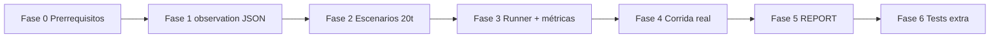

# Plan de implementación pendiente — Sesión 6

Contraste entre:

- Material: `IAENG/material/mat-sesion6.md` (ejercicio pre-sesión stress CAG)
- Referencia LIDR: [ai-engineering/session_06/estimator](https://github.com/LIDR-academy/ai-engineering/tree/session_06/estimator)
- Estado actual: `estimador-cag` en `pre-session-06`

Documentos relacionados:

- Bitácora de lo ya hecho en código: [README.md](./README.md)
- Análisis previo: [GAP-ANALISIS.md](./GAP-ANALISIS.md)

---

## Resumen ejecutivo

| Capa | Veredicto |
|------|-----------|
| **Código base S6** (turn_observed, compression, tier, ACB, golden evals, stress skeleton) | **~85%** — implementado |
| **Entregable medible** (CSV + REPORT con datos reales y lectura cuantitativa) | **~25%** — bloqueado por corrida fallback y escenarios cortos |
| **Paridad LIDR `session_06`** | **~70%** — faltan escenarios 20 turnos, `observation` en JSON, runner alineado, tests de stress/compression |

**Conclusión:** no hace falta reescribir S6 desde cero. El plan siguiente cierra brechas de **medición**, **contrato HTTP del stress runner** y **artefactos de entrega**.

---

## Matriz de cumplimiento

### Ya implementado (mantener)

| Ítem | Material S6 | LIDR S6 | Tu repo |
|------|-------------|---------|---------|
| `turn_observed` 13 campos + structlog | Sí | Sí (`TurnObservation`) | Sí (`session_estimation.py`, log + `last_turn_observed`) |
| Compresión (summary + anchors) | Directo (no pre) | Sí | Sí (`app/sessions/compression/`) |
| Tier dinámico + reglas | Directo | Sí | Sí (`tier_resolver.py`) |
| Metadata LLM extractor | Opcional S5 | Sí | Sí (`metadata_extractor.py`) |
| ACB opcional | Directo | Sí (`ACBResponse`) | Sí (`estimate-acb`) |
| Golden evals 16 casos | Punto de partida | Sí | Sí (`evals/golden_dataset.json`, `evals/run.py`) |
| Stress: 3 escenarios + fact-tracker | Sí | Sí (20 turnos c/u) | Parcial (6 turnos) |
| PDF builder 5/20/50/100 KB | Sí | Sí | Sí (`build_pdfs.py`) |
| Métricas stress + tests unitarios | Sí | Sí | Sí (`evals/stress/metrics.py`, `test_stress_metrics.py`) |
| Runner CLI + CSV | Sí | Sí | Sí (`evals/stress/run.py`) |
| `GET /sessions/{id}` debug | Recomendado | Sí | Sí (enriquecido S6) |
| `MetricResult` compartido | Sí | Sí | Sí (`evals/metrics.py`) |

### Pendiente (este plan)

| Ítem | Material | LIDR | Prioridad |
|------|----------|------|-----------|
| Corrida stress **real** (sin fallback masivo) | Criterio “hecho” | Implícito | **P0** |
| Escenarios **20 turnos** por perfil | Implícito (turno 20) | Obligatorio en código | **P0** |
| `observation` en body de `POST .../estimate` | Implícito (1 evento/turno) | `EstimationResponse.observation` | **P1** |
| MemoryDrift **N > k** + `fact_field` | Sí (turnos posteriores) | Sí | **P1** |
| Runner sin fallback silencioso; fallar si API cae | — | Sí (raise, no fake rows) | **P1** |
| Modo `--http` vs TestClient in-process | Opcional material | Sí | **P2** |
| `build_report.py` + REPORT cuantitativo | Sí | Manual (alumno) | **P0 entrega** |
| Recall adjunto en respuesta/summary | Bloque 3 | — | **P2** |
| Tests `test_stress_runner.py` | — | Sí | **P2** |
| Tests compresión (`anchors`, `policy`) | — | Sí | **P3** |
| Resumen CLI post-corrida (P50/P95) | — | `_print_summary` | **P2** |
| CSV matriz completa 3×5×3×N | ≥50 filas | ~900+ filas con 20 turnos | **P0** |

### Fuera de alcance (no implementar en S6)

| Ítem | Por qué |
|------|---------|
| RAG / pgvector / ingest presupuestos JSON | Material S6 + S7 |
| Cache semántica en sesiones | Altera baseline CAG; documentar N/A en reporte |
| Optimizar `MAX_CONVERSATION_TURNS` para “mejorar” curvas | Invalida comparación |
| Jupyter / matplotlib | Deliverable = CSV + Markdown |
| Salida estructurada Instructor en sesiones (como LIDR S6) | Evolución del **directo** S4/S6 en vivo, no del pre-ejercicio stress |

---

## Fases de implementación

### Fase 0 — Prerrequisitos (0.5 h)

- [ ] API levantada: `uv run uvicorn app.main:app --host 127.0.0.1 --port 8000`
- [ ] `.env` con `OPENAI_API_KEY` o `ANTHROPIC_API_KEY` válida
- [ ] `uv run pytest -q` verde antes de tocar stress
- [ ] Regenerar PDFs: `uv run python -m evals.stress.fixtures.build_pdfs`

**Criterio:** un `POST /api/v1/sessions/{id}/estimate` manual devuelve 200 con `text` no vacío.

---

### Fase 1 — Contrato `observation` en respuesta (P1, ~2 h)

**Objetivo:** alinear stress runner con LIDR sin parsear logs.

| Tarea | Archivos |
|-------|----------|
| Crear `TurnObservation` en `app/schemas/sessions.py` (o `estimation.py`) con los 13 campos + `cache_hit_kind` literal |
| Añadir `observation: TurnObservation \| None` a `SessionEstimationResponse` |
| Poblar en `estimate_session_turn` y devolver en JSON |
| Mantener `log.info("turn_observed", ...)` y `last_turn_observed` en debug GET |
| Test: respuesta estimate incluye `observation.turn_index` coherente |

**Commit sugerido:** `feat(session-06): expose TurnObservation on session estimate response`

---

### Fase 2 — Escenarios 20 turnos (P0, ~3 h)

**Objetivo:** medir ruptura de memoria en turno 20 (material + [LIDR scenarios](https://github.com/LIDR-academy/ai-engineering/blob/session_06/estimator/evals/stress/scenarios.py)).

| Tarea | Detalle |
|-------|---------|
| Reescribir o ampliar `evals/stress/scenarios.py` | 20 turnos en `growing`, `pivot`, `contradiction` |
| Campos por turno | `transcript`, `fact_introduced`, `fact_field` (`project_name` \| `technologies` \| `any`) |
| Incluir enums por escenario | `project_type`, `detail_level`, `output_format` (como LIDR) para el multipart del runner |
| Turno 1 de `growing` | Anchor `Nimbus` + `fact_field=project_name` |
| Turno 5 `pivot` | Cambio explícito React → Flutter |
| Turno 8 `contradiction` | Presupuesto 30k → 80k |

**Commit sugerido:** `feat(stress): add 20-turn scenarios aligned with session_06 reference`

---

### Fase 3 — Métricas y runner stress (P0–P1, ~4 h)

| Tarea | Detalle |
|-------|---------|
| `MemoryDriftMetric` | Buscar `fact` en campo acotado (`project_name`, `technologies`, metadata blob, summary, anchors) |
| Evaluar drift solo en `turn_index > 1` para el fact del turno 1 (patrón LIDR) |
| `evals/stress/run.py` | Leer `observation` del JSON de estimate (Fase 1); eliminar fallback offline por defecto |
| Flag `--allow-fallback` | Solo para desarrollo sin API |
| Exit code ≠ 0 si `runner_fallback_rate > 0.2` o filas con `error` |
| Modo TestClient | `--http` omitido → `TestClient` + store aislado (smoke/CI) |
| Enviar `project_type`, `detail_level`, `output_format` en Form por escenario |
| Columnas CSV fijas (como LIDR): `latency_budget_passed`, `memory_drift_passed`, `wall_clock_ms`, `error` |
| `_print_summary` al final | P50/P95 y coste por `scenario × kb` |
| Marcador en PDF | `STRESS_MARKER_42` en `build_pdfs.py` + columna `attachment_recall_score` (opcional P2) |

**Commit sugerido:** `feat(stress): harden runner and align metrics with session_06`

---

### Fase 4 — Corrida real + artefactos (P0, ~0.5–2 h + coste API)

```bash
uv run python -m evals.stress.run \
  --http http://127.0.0.1:8000 \
  --scenarios growing,pivot,contradiction \
  --attachment-sizes 0,5,20,50,100 \
  --repeats 3 \
  --latency-budget-ms 8000 \
  --cost-budget-usd 0.25 \
  --output evals/stress/results.csv
```

| Validación | Umbral |
|------------|--------|
| Filas CSV | ≥ 50 (con 20 turnos × 3 × 5 × 3 ≫ 50) |
| `runner_fallback` | < 20% de filas |
| `latency_ms`, `cost_usd` | Mayoría > 0 |

**Commit sugerido:** `chore(stress): refresh results.csv from live API run` (solo si quieres versionar CSV; si no, dejar local y documentar)

---

### Fase 5 — Reporte cuantitativo (P0, ~2 h)

| Tarea | Entregable | Estado |
|-------|------------|--------|
| `evals/stress/build_report.py` | Lee `results.csv` → regenera `REPORT.md` | Hecho |
| Tabla resumen | Por `scenario × attachment_size_kb`: P50/P95 latency, costo total, recall drift medio, cache (exact/semantic N/A) | Hecho |
| Tres curvas en tabla | latency vs tokens_in; costo acumulado vs turn_index; drift vs N | Hecho |
| Dos párrafos | Con cifras reales (ej. “a partir del turno 12…”, “turno 20 cuesta X× turno 1”) | Hecho (con datos actuales; turno máx 6) |
| README | Sección “Reproducir stress S6” con prerequisitos y coste estimado | Hecho |

**Commit sugerido:** `doc(stress): regenerate REPORT.md from results with quantitative analysis`

---

### Fase 6 — Tests adicionales (P2–P3, ~2 h)

| Test | Referencia LIDR |
|------|-----------------|
| `tests/test_stress_runner.py` | Smoke in-process con LLM mockeado; CSV con columnas esperadas |
| `tests/test_compression_anchors.py` | Promoción de anchors desde texto evictado |
| `tests/test_compression_policy.py` | Summary crece y respeta `MAX_SUMMARY_CHARS` |
| `tests/test_evals_run.py` | Opcional; golden runner sin red |

**Commit sugerido:** `test(session-06): add stress runner and compression coverage`

---

## Orden recomendado de ejecución



No ejecutar Fase 4 antes de F1–F3: el CSV actual con fallback no sirve para el entregable final.

---

## Diferencias con LIDR que puedes documentar (no bloquean)

| Tema | Tu elección | Nota para REPORT |
|------|-------------|------------------|
| Respuesta sesión en texto libre vs `EstimationResult` | Texto libre + metadata view | Pre-ejercicio S6 no exige Instructor en sesiones |
| Rutas `/api/v1/...` | Convención desde S4 | OK |
| `cache_hit_kind` siempre `none` en sesiones | Sin cache conversacional | Indicar en tabla resumen |
| Módulos en `app/services/` vs `app/sessions/` | Histórico del repo | OK funcional |

---

## Checklist final “hecho” (material + entrega)

- [x] Código: `turn_observed`, stress package, métricas, tests unitarios stress
- [x] `POST .../estimate` devuelve `observation` en JSON
- [x] Escenarios con **20 turnos** cada uno (en código)
- [x] Runner: form enums, `--mode acb`, `--allow-fallback`, exit code por `--max-error-rate`, `STRESS_MARKER` + recall
- [x] `build_report.py`, tests runner/compresión/recall (90 tests)
- [x] README actualizado (reproducir stress + build_report)
- [ ] `evals/stress.run` corrida completa sin errores dominantes
- [ ] `results.csv` con matriz completa (~900 filas, 20 turnos) y cabecera
- [ ] `REPORT.md` regenerado tras CSV final (afirmaciones con turno 12/20)

---

## Estimación de esfuerzo

| Fases | Tiempo | Coste API (orientativo) |
|-------|--------|-------------------------|
| F0 + F1 + F2 + F3 | 1–2 días dev | — |
| F4 corrida completa | 30–90 min | Variable (20×3×5×3 ≈ 900 llamadas LLM si 20 turnos) |
| F5 + F6 | 0.5–1 día | — |

Para reducir coste en desarrollo: `--repeats 1`, un solo escenario, o `--attachment-sizes 0` hasta validar pipeline; luego corrida completa para entregar.

---

## Referencias

- [LIDR session_06/estimator](https://github.com/LIDR-academy/ai-engineering/tree/session_06/estimator)
- `IAENG/material/mat-sesion6.md`
- Artefactos actuales: `evals/stress/results.csv`, `evals/stress/REPORT.md`
