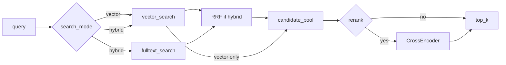

# Plan de implementación — Sesión 10 (híbrida + reranking + medición)

Contraste entre:

- **Material:** `mat-sesion10.md` (ejercicio: full-text, RRF, reranker, golden set A–D)
- **Repo:** `estimador-cag`, rama **`session-10/pre-work`** (desde `session-09/pre-work`)
- **Estado previo:** S8 completo (pgvector + `/search`); S9 pre-work = diagnóstico (sin RAG end-to-end)

---

## Resumen ejecutivo

| Capa | Estado en `session-09/pre-work` | Tras S10 |
|------|---------------------------------|----------|
| Search vectorial | `POST /search` coseno | Se mantiene como modo A |
| Full-text Postgres | No | `content_tsv` + GIN (`spanish`) |
| Fusión RRF | No | Híbrida = vector ∥ léxica + RRF |
| Reranker cross-encoder | No | Recall-50 → top-5, toggle |
| Medición | Solo ojímetro / S9 trace | Golden set + precision@5 + latencia |
| Entregable | — | Tabla A–D + conclusiones + PR |

**Esfuerzo orientativo:** 1–2 días + tiempo de descarga del modelo + ~30–60 min de anotación del golden set + corridas A–D.

---

## Decisiones de adaptación (cerradas)

| Tema | Decisión |
|------|----------|
| Rama | `session-10/pre-work` desde `session-09/pre-work` |
| Alcance funcional | **Solo recuperación** (no orquestador RAG ni cambios a `/estimate`) |
| Paquete | `app/embedding_pipeline/retrieval/` (adaptación local; no `app/generation/rag/`) |
| Migración | `0002_session10_fulltext.py`: `content_tsv` GENERATED ALWAYS AS (`to_tsvector('spanish', content)`) STORED + GIN |
| RRF | Constante `k = 60`; función pura sobre listas de `chunk_id` |
| API | Extender `SearchRequest`; defaults = S8 (vectorial, `rerank=false`, `k=5`) |
| Modos | `search_mode`: `vector` \| `hybrid`; `rerank`: bool; `candidate_pool_size`: default 50 |
| Reranker | Modelo multilingüe ligero (default `cross-encoder/mmarco-mMiniLMv2-L12-H384-v1` o el del wrapper LIDR si se porta); lazy singleton; `asyncio.to_thread` |
| Toggle | Settings `RERANKING_ENABLED` **y** flag por request `rerank` (request gana si se envía; settings = default) |
| Precision | A nivel **`budget_id`** (dedupe en top-k al medir: un budget cuenta una vez en los 5 slots del ranking agregado por presupuesto, o precision sobre los budgets de los top-5 chunks — ver Fase 6) |
| Medición | `evals/retrieval/golden_set.json` + `scripts/measure_retrieval.py` |
| Informe | `evals/retrieval/REPORT.md` (tabla + párrafo) |
| Deps | Mover `sentence-transformers` a dependencies de runtime (o extra `retrieval` instalado en Docker) |
| Idioma código | Inglés (nombres, logs, mensajes); observaciones del informe en español |

---

## Relación con Sesiones 8–9

- **S8** aporta el almacén y la rama vectorial. S10 **no reescribe** chunker ni embedder.
- **S9 pre-work** documentó el gap (transcripción cruda → distancias comprimidas; estimate sin retrieval). S10 ataca **ranking/relevancia** con híbrida + rerank y **números**, no la generación.
- Artículos 4–6 del material (expansión, routing, filtros) → **sesión en vivo**; no implementar.



---

## Alcance (material)

### Entra

| Ítem | Detalle |
|------|---------|
| Migración tsvector + GIN | Config `spanish` |
| Full-text search | `websearch_to_tsquery` + `ts_rank` + `@@` |
| RRF | Fusión vector + léxico |
| Reranker | Integrar CrossEncoder; recall-then-rerank |
| Toggle rerank | Sin tocar código de producción para off/on |
| Golden set 5 queries | Anotación manual binaria |
| Configs A–D | Vector/híbrida × rerank off/on |
| Métricas | precision@5 + latencia mediana (caliente) |
| Conclusiones | Config elegida + justificación trade-off |
| PR + mail | Rama `session-10/pre-work` |

### No entra

| Ítem | Motivo |
|------|--------|
| Query expansion / decomposition | Artículos 4–6 / en vivo |
| Multi-índice / routing | En vivo |
| Filtros `metadata->>'sector'` | En vivo |
| Orquestador RAG → estimate | Fuera del ejercicio; medición es de retrieval |
| Elasticsearch / BM25 externo | Postgres basta |
| Cambios Streamlit | No requeridos |

---

## Configuraciones a medir (Paso 4 del material)

| Config | `search_mode` | `rerank` |
|--------|---------------|----------|
| **A** | `vector` | `false` |
| **B** | `hybrid` | `false` |
| **C** | `vector` | `true` |
| **D** | `hybrid` | `true` |

Pool amplio cuando `rerank=true`: `candidate_pool_size=50`, salida `k=5`.  
Cuando `rerank=false`: recuperar directamente top-`k` (o top-50 y truncar — documentar en harness; preferencia: pedir `limit=k` a cada rama y fusionar truncando a `k` para B; para C/D pedir `limit=50` y recortar tras rerank).

---

## Fases de implementación

### Fase 0 — Prerrequisitos y verify del entorno (30–45 min)

| Tarea | Detalle |
|-------|---------|
| Stack | `docker compose up -d postgres ai_service` |
| Migraciones S8 | `alembic upgrade head` (0001) |
| Corpus | `scripts/ingest_sample_corpus.py` (15 OK / SKIP) |
| Deps reranker | Añadir `sentence-transformers` al runtime / Docker |
| Settings | `RERANKER_MODEL_NAME`, `RERANKING_ENABLED`, etc. |

**Checkpoint:** search vectorial responde; tras Fase 4, `verify_reranker` descarga y carga el modelo.

**Commit sugerido:** `chore(session-10): add sentence-transformers and retrieval settings`

---

### Fase 1 — Migración full-text (1–2 h)

| Tarea | Archivo |
|-------|---------|
| Migración Alembic | `alembic/versions/0002_session10_fulltext.py` |
| ORM opcional | `app/db/models.py` — columna `content_tsv` (Mapped, `Computed` / server-generated) |

SQL objetivo (equivalente):

```sql
ALTER TABLE chunks
ADD COLUMN content_tsv tsvector
GENERATED ALWAYS AS (to_tsvector('spanish', content)) STORED;

CREATE INDEX ix_chunks_content_tsv
ON chunks USING gin (content_tsv);
```

Nota: el corpus ya ingerido se rellena automáticamente (STORED generated). No hace falta re-ingest.

```bash
docker compose exec ai_service uv run alembic upgrade head
```

**Checkpoint:** `\d chunks` muestra `content_tsv`; consulta `@@` de prueba con un término conocido (p. ej. `Stripe`) devuelve filas.

**Commit sugerido:** `feat(session-10): add spanish tsvector column and GIN index on chunks`

---

### Fase 2 — Full-text + RRF + pipeline híbrido (2–4 h)

| Tarea | Archivo |
|-------|---------|
| RRF puro | `app/embedding_pipeline/retrieval/fusion.py` |
| Búsqueda léxica | `app/embedding_pipeline/retrieval/fulltext.py` |
| Orquestación | `app/embedding_pipeline/retrieval/pipeline.py` |
| Extraer vector search | Mover lógica de `_semantic_search` a `retrieval/vector.py` o función interna reutilizable |
| `__init__.py` | Exportar API mínima del paquete |

```python
# fusion.py — firma objetivo
def reciprocal_rank_fusion(
    rankings: list[list[int]],
    k: int = 60,
) -> list[int]:
    ...
```

```python
# hybrid: asyncio.gather(vector, fulltext) → RRF → chunks ordenados
```

**Checkpoint:** para query `"Stripe payment webhooks"`, la rama léxica ubica chunks de checkout Stripe cerca del top; la híbrida sube ese consenso frente a vector solo.

**Commit sugerido:** `feat(session-10): add full-text search and RRF hybrid retrieval`

---

### Fase 3 — Reranker (2–3 h)

| Tarea | Archivo |
|-------|---------|
| Wrapper CrossEncoder | `app/embedding_pipeline/retrieval/reranker.py` |
| Verify CLI | `app/embedding_pipeline/retrieval/verify_reranker.py` (`python -m …`) |
| Integración pipeline | `pipeline.py`: si rerank → score pool → top_k |
| Thread offload | `asyncio.to_thread(reranker.rerank, …)` |

Patrón del material:

1. Cargar modelo **una vez** (lazy singleton o lifespan).
2. Entrada/salida: lista de candidatos (mismo shape).
3. Log estructurado: `candidates_in`, `candidates_out`, `model`.

```bash
docker compose exec ai_service uv run python -m app.embedding_pipeline.retrieval.verify_reranker
```

**Checkpoint:** verify OK; con rerank on, el orden del top-5 puede diferir del vectorial para queries ambiguas (ecommerce vs payments).

**Commit sugerido:** `feat(session-10): integrate cross-encoder reranker with toggle`

---

### Fase 4 — Extender endpoint `/search` (1–2 h)

| Tarea | Archivo |
|-------|---------|
| Extender schema | `app/embedding_pipeline/schemas.py` |
| Router | `app/embedding_pipeline/router.py` → delegar a `pipeline.retrieve` |
| Tests | `tests/test_search_router.py` (+ tests fusion/hybrid unitarios) |

`SearchRequest` objetivo:

```python
class SearchRequest(BaseModel):
    query: str = Field(min_length=1)
    k: int = Field(default=5, ge=1, le=100)
    search_mode: Literal["vector", "hybrid"] = "vector"
    rerank: bool = False
    candidate_pool_size: int = Field(default=50, ge=1, le=100)
```

`SearchResultItem`: mantener campos S8; opcionalmente añadir `score` / `rrf_score` / `rerank_score` si ayuda al debug (no obligatorio para el entregable).

Compatibilidad: body `{"query": "…", "k": 5}` → comportamiento idéntico a S8.

**Checkpoint:** las cuatro configs A–D invocables por curl/script.

**Commit sugerido:** `feat(session-10): extend search endpoint with hybrid and rerank modes`

---

### Fase 5 — Golden set (1–2 h, dominio)

Archivo: `evals/retrieval/golden_set.json`

```json
{
  "annotation_criterion": "Relevant if it would serve as a direct effort reference for estimating this project",
  "queries": [
    {
      "id": "q01",
      "query": "...",
      "relevant_budget_ids": ["BUD-..."]
    }
  ]
}
```

**Mezcla recomendada (5 queries)** alineada al material y al corpus local:

| id | Perfil | Idea de query | Candidatos relevantes (anotar a mano) |
|----|--------|---------------|----------------------------------------|
| q01 | Directa / ecommerce | Catálogo + cart + admin | p. ej. `BUD-2023-008`, quizá `BUD-2023-012` |
| q02 | Dominios colindantes | E-commerce vs pagos (ambigüedad) | Marcar solo presupuestos e-commerce útiles; no wallet/UPI si no sirven para estimar |
| q03 | Término exacto | Mencionar **Stripe** / webhooks | Presupuestos cuyo chunk cita Stripe |
| q04 | Otro dominio claro | HIPAA / citas / paciente | `BUD-2024-021` (± FHIR si aplica) |
| q05 | Larga / ruidosa | Resumen estilo transcripción (o fragmento de `02_ambiguous`) | Anotar budgets que usarías de verdad |

Criterio escrito **antes** de anotar. Relevancia **binaria**. Revisar el golden set en el PR (cambiarlo cambia todas las mediciones).

**Commit sugerido:** `test(session-10): add retrieval golden set with five annotated queries`

---

### Fase 6 — Harness de medición (1–2 h)

| Tarea | Archivo |
|-------|---------|
| Script | `scripts/measure_retrieval.py` |
| CLI | Flags o env: config A\|B\|C\|D, o correr las cuatro |
| Protocolo | Descartar 1ª ejecución (frío); 3–5 runs; **mediana** de latencia |
| Precision | `precision_at_k` sobre `budget_id` de cada hit en top-`k` |

Definición de precision@5 (cerrada):

1. Ejecutar retrieval → lista de chunks ordenados.
2. Tomar los primeros `k=5` chunks.
3. Extraer `metadata.budget_id` de cada uno.
4. `hits / k` donde hit = ese `budget_id` ∈ `relevant_budget_ids` (un slot por chunk; si el mismo budget aparece 3 veces, cuenta 3/5 si es relevante — refleja el problema de monopolio de S9; opcionalmente reportar también precision sobre **budgets únicos** en top-5 como nota en REPORT).

El script vive en `scripts/` (no módulo de aplicación), como indica el material.

Ejemplo de invocación:

```bash
uv run python scripts/measure_retrieval.py --config all
# o: --config A  (vector, no rerank)
```

**Checkpoint:** tabla con mean precision@5 y median latency_ms para A, B, C, D.

**Commit sugerido:** `feat(session-10): add retrieval measurement harness for configs A-D`

---

### Fase 7 — Ejecutar, concluir, entregar (2–3 h)

| Tarea | Detalle |
|-------|---------|
| Correr A–D | Stack caliente; mismo golden set |
| Informe | `evals/retrieval/REPORT.md` |
| README proyecto | Breve modo “Sesión 10 — hybrid + rerank” (si aplica) |
| PR | Contra `main` (o convención del curso) |
| Mail | Enlace PR + tabla a lia@lidr.co |

Plantilla de tabla para el mail / REPORT:

| Config | Búsqueda | Rerank | precision@5 (media) | latencia mediana (ms) |
|--------|----------|--------|---------------------|------------------------|
| A | Vectorial | No | | |
| B | Híbrida | No | | |
| C | Vectorial | Sí | | |
| D | Híbrida | Sí | | |

Párrafo de conclusiones (español): ¿qué config usaríais y por qué? ¿La ganancia del rerank justifica la latencia frente al presupuesto total de una estimación (segundos de LLM)?

**Commit sugerido:** `docs(session-10): add retrieval measurement report and conclusions`

---

## Esqueleto de módulos

```text
app/embedding_pipeline/retrieval/
  __init__.py
  fusion.py           # RRF
  fulltext.py         # lexical search
  vector.py           # cosine search (extracted)
  reranker.py         # CrossEncoder wrapper
  pipeline.py         # compose modes
  verify_reranker.py  # CLI smoke test

evals/retrieval/
  golden_set.json
  REPORT.md           # post-medición

scripts/measure_retrieval.py
alembic/versions/0002_session10_fulltext.py
```

---

## Settings nuevos (propuesta)

| Variable | Default | Uso |
|----------|---------|-----|
| `RERANKING_ENABLED` | `false` | Default del endpoint si el body no fuerza |
| `RERANKER_MODEL_NAME` | `cross-encoder/mmarco-mMiniLMv2-L12-H384-v1` | Modelo local multilingüe |
| `RETRIEVAL_CANDIDATE_POOL_SIZE` | `50` | Recall amplio |
| `RETRIEVAL_TOP_K` | `5` | Salida al consumidor |
| `RRF_SMOOTHING_K` | `60` | Suavizado RRF |

---

## Tests sugeridos

| Test | Qué cubre |
|------|-----------|
| `test_rrf_fusion` | Consenso de dos rankings; id solo en un ranking queda abajo |
| `test_fulltext_stripe` | Fixture DB o mock: término exacto recupera chunk Stripe |
| `test_search_modes_contract` | Body sin flags = S8; hybrid/rerank aceptados |
| `test_precision_at_k` | Función pura del harness |

Evitar tests que descarguen el modelo en CI si no hay cache; marcar verify/rerank e2e como manual u opcional (`@pytest.mark.slow`).

---

## Checklist de aceptación (material)

- [ ] Migración `tsvector` + GIN con config española
- [ ] Híbrida = léxica + vectorial + RRF
- [ ] Reranker recall-then-rerank, activable/desactivable
- [ ] `verify_reranker` OK
- [ ] Golden set 5 queries anotadas a mano
- [ ] Tabla A–D (precision@5 + latencia)
- [ ] Conclusiones argumentadas
- [ ] PR en `session-10/pre-work` + mail con enlace y tabla
- [ ] **No** hay expansión de queries / routing / filtros metadata

---

## Orden de commits sugerido

1. `chore(session-10): add sentence-transformers and retrieval settings`
2. `feat(session-10): add spanish tsvector column and GIN index on chunks`
3. `feat(session-10): add full-text search and RRF hybrid retrieval`
4. `feat(session-10): integrate cross-encoder reranker with toggle`
5. `feat(session-10): extend search endpoint with hybrid and rerank modes`
6. `test(session-10): add retrieval golden set with five annotated queries`
7. `feat(session-10): add retrieval measurement harness for configs A-D`
8. `docs(session-10): add retrieval measurement report and conclusions`

---

## Referencias

- Material: `mat-sesion10.md`
- Gap: [`GAP-ANALISIS.md`](./GAP-ANALISIS.md)
- S8: [`../session-08/PLAN-IMPLEMENTACION.md`](../session-08/PLAN-IMPLEMENTACION.md)
- S9 diagnosis: [`../../../arquitectura-actual.md`](../../../arquitectura-actual.md)
- LIDR: `https://github.com/LIDR-academy/ai-engineering` rama `session_10`
